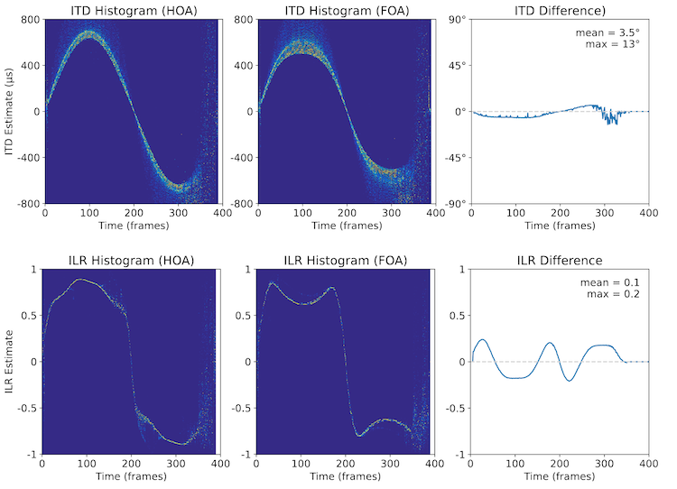
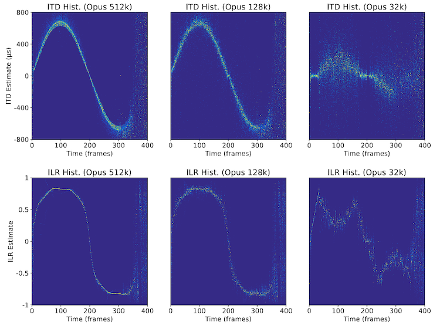

# Binaspect

- Full reference binaural fidelity testing toolbox in Python.
- Compute and visualize interaural cues (ITD, IPD, ILR, ILD) spectrograms and histograms.
- Visualize degradations in spatial fidelity between test and reference signals.
- Simple similarity metrics for comparisons.

Binaspect is an open-source Python library for binaural audio analysis, visualization, and feature generation. It computes modified interaural time and level-difference spectrograms to produce interpretable "azimuth maps" by clustering time–frequency bins into stable time–azimuth histogram representations. Multiple active sources appear as distinct azimuthal clusters, while degradations manifest as broadened, fused, or shifted distributions. Binaspect operates blindly on audio (no head-model priors required), enabling researchers and engineers to inspect how binaural cues are affected by codecs, renderers, and other processing.

## Citation
You can read the paper here: [https://arxiv.org/abs/2510.25714](https://arxiv.org/abs/2510.25714). If you use Binaspect in your research, please cite as follows:

```
@misc{barry2025binaspectpythonlibrary,
      title={Binaspect -- A Python Library for Binaural Audio Analysis, Visualization & Feature Generation}, 
      author={Dan Barry and Davoud Shariat Panah and Alessandro Ragano and Jan Skoglund and Andrew Hines},
      year={2025},
      eprint={2510.25714},
      archivePrefix={arXiv},
      primaryClass={cs.SD},
      url={https://arxiv.org/abs/2510.25714}, 
}
```

## Features

- Histograms: time–varying histograms for ITD/ILR/ILD (`ITD_hist`, `ILR_hist`, `ILD_hist`).
- Similarity: simple comparison metrics (`ITD_sim`, `ILR_sim`).
- ITD/IPD/ILR/ILD: spectrogram functions (`ITD_spect`, `IPD_spect`, `ILR_spect`, `ILD_spect`).
- Inspection: functions to compare ILR/ITD histograms (`ILR_spect_diff`, `ITD_spect_diff`).
- Examples: runnable scripts under `examples/` that load audio and render figures.

## Requirements

- Python 3.10 or higher
- Dependencies are listed in `requirements.txt` (notably: `numpy`, `matplotlib`, `librosa`).

## Installation

```bash
# From repo root
python3 -m venv --prompt venv_binaspect venv_binaspect
source venv_binaspect/bin/activate
python -m pip install --upgrade pip
python -m pip install -r requirements.txt
```

## Example Usage

```python
import librosa
import binaspect

# Load ref and test audio (2 x N) at a fixed sample rate
ref_audio, sr = librosa.load("path/to/file.wav", sr=44100, mono=False)
test_audio, sr = librosa.load("path/to/file.wav", sr=44100, mono=False)

# Compute ITD and ILR Differences with plots
ITD_spect_diff(ref_audio, test_audio, sr, title="", plots=True)
ILR_spect_diff(ref_audio, test_audio, sr, title="", plots=True)

```

## Example Scripts
The following scripts demonstrate some practical uses of the library for various tasks and might serve as a useful template for your own projects:


<br>

- [ambisonics_example.py](examples/ambisonics_example.py) - Basic example comparing HOA and FOA ambisonic renders of castanets moving from 0 to 300 degrees. Plots ILR and ITD histograms and clearly shows differences in spatial representation.

<br>

<p align="center">
    
</p>

- Reference (HOA): [Download Audio](https://raw.githubusercontent.com/QxLabIreland/Binaspect/main/audio/ambisonic_examples/castanetsRev_dynamic_A0_A360_E30_HOA_REF_rendered.wav)
- Test (FOA): [Download Audio](https://raw.githubusercontent.com/QxLabIreland/Binaspect/main/audio/ambisonic_examples/castanetsRev_dynamic_A0_A360_E30_FOA_REF_rendered.wav)

---
<br>
 
- [codec_example.py](examples/codec_example.py) - Compares lossy codec effects on binaural cues using ILR and ITD histograms and similarity scores. Example shows Opus codec at 512 kbps, 128 kbps, and 32 kbps on castanets audio moving from 0 to 300 degrees.

<br>

<p align="center">
    
</p>

- Opus 512k: [Download Audio](https://raw.githubusercontent.com/QxLabIreland/Binaspect/main/audio/opus_examples/castanets360_opus512k.wav)
- Opus 128k: [Download Audio](https://raw.githubusercontent.com/QxLabIreland/Binaspect/main/audio/opus_examples/castanets360_opus128k.wav)
- Opus 32k: [Download Audio](https://raw.githubusercontent.com/QxLabIreland/Binaspect/main/audio/opus_examples/castanets360_opus32k.wav)

---

<br>

- [downmix_example.py](examples/downmix_example.py) - Examines binaural cue preservation in stereo downmixes from multichannel audio. This example shows a 7.1 source downmixed to 5.1 using ITD and ILR histograms and similarity scores. The audio contains two static sources at 0 and 90 degrees.

<br>

<p align="center">
    
</p>

- Rendered 7.1: [Download Audio](https://raw.githubusercontent.com/QxLabIreland/Binaspect/main/audio/downmix_example/2_source_7_1.wav)
- Rendered 5.1: [Download Audio](https://raw.githubusercontent.com/QxLabIreland/Binaspect/main/audio/downmix_example/2_source_5_1.wav)

---

<br>

To run, use: `python -m examples.name_of_example`

## Development

- Library code lives in `binaspect.py` (import-safe; no top-level execution).
- Examples live under `examples/` and handle their own plotting and assets.

## License

See `LICENSE` in the repository root.

## Table of Contents

- [Usage](#usage)
- [Examples](#example-scripts)
- [Development](#development)
- [API Documentation](#api-documentation)
- [License](#license)

## API Documentation

[Back Table of Contents](#table-of-contents)
## ITD_hist
```
ITD_hist(input_file, sr, hist_size=400, start_freq=50, stop_freq=620, normalize=True, energyweighting=True, plots=False)
```

**Description**: Builds time-varying histograms of ITD values across the selected band; can normalize per-frame and weight by energy.

**Parameters**:

- `input_file` (numpy array, shape `(2, N)`): Stereo signal.
- `sr` (int): Sample rate in Hz.
- `hist_size` (int): Number of delay bins (default 400).
- `start_freq` (float|int): Start frequency in Hz (typ. 50).
- `stop_freq` (float|int): Stop frequency in Hz (typ. 620).
- `normalize` (bool): Normalize each frame histogram to [0, 1] when max > 0.
- `energyweighting` (bool): Weight counts by magnitude.
- `plots` (bool): If True, render a figure.

**Usage Example**:
```python
itd_hist = ITD_hist(audio, 44100, hist_size=400, plots=False)
```

[Back Table of Contents](#table-of-contents)
## ILR_hist
```
ILR_hist(input_file, sr, hist_size=400, start_freq=1700, stop_freq=4600, normalize=True, energyweighting=True, plots=False)
```

**Description**: Time-varying histograms of ILR values in [-1, 1], emphasizing peaks; frequency band defaults target directional cues.

**Parameters**:

- `input_file` (numpy array, shape `(2, N)`): Stereo signal.
- `sr` (int): Sample rate in Hz.
- `hist_size` (int): Number of level bins (default 400).
- `start_freq` (float|int): Start frequency in Hz (typ. 1700).
- `stop_freq` (float|int): Stop frequency in Hz (typ. 4600).
- `normalize` (bool): Normalize per-frame histogram.
- `energyweighting` (bool): Weight counts by magnitude.
- `plots` (bool): If True, render a figure.

**Usage Example**:
```python
ilr_hist = ILR_hist(audio, 44100, hist_size=400)
```

[Back Table of Contents](#table-of-contents)
## ILD_hist
```
ILD_hist(input_file, sr, hist_size=400, start_freq=1700, stop_freq=4600, dB_range=24, normalize=True, energyweighting=True, plots=False)
```

**Description**: Time-varying histograms of ILD (dB) within a high-frequency band; `dB_range` controls labeling in example plots.

**Parameters**:

- `input_file` (numpy array, shape `(2, N)`): Stereo signal.
- `sr` (int): Sample rate in Hz.
- `hist_size` (int): Number of dB bins (default 400).
- `start_freq` (float|int): Start frequency in Hz (typ. 1700).
- `stop_freq` (float|int): Stop frequency in Hz (typ. 4600).
- `dB_range` (float|int): Plot label range, in dB (default 24).
- `normalize` (bool): Normalize per-frame histogram.
- `energyweighting` (bool): Weight counts by magnitude.
- `plots` (bool): If True, render a figure.

**Usage Example**:
```python
ild_hist = ILD_hist(audio, 44100, hist_size=400, dB_range=24)
```

[Back Table of Contents](#table-of-contents)
## ITD_sim
```
ITD_sim(ref, test, sr, mode='signed', plots=False)
```

**Description**: Basic objective similarity score between ITD spectrograms; `mode` ('signed'|'unsigned') affects scaling. In 'signed' mode, score ranges [-1, 1]; in 'unsigned' mode, [0, 1]. In signed mode, a score of 1 means perfect match, -1 means perfect inverse. For example if the test signal has a source at 90 degrees but the reference is at -90 degrees, the score would be -1. In unsigned mode, the same condition would result in a score of 0.

**Parameters**:

- `ref` (numpy array, shape `(2, N)`): Reference stereo signal.
- `test` (numpy array, shape `(2, N)`): Test stereo signal.
- `sr` (int): Sample rate in Hz.
- `mode` (str): 'signed' or 'unsigned' (default 'signed').
- `plots` (bool): If True, render diagnostic figures.

**Usage Example**:
```python
score = ITD_sim(ref, test, 44100, mode='unsigned')
```

[Back Table of Contents](#table-of-contents)
## ILR_sim
```
ILR_sim(ref, test, sr, mode='signed', plots=False)
```

**Description**: Similarity score between ILR spectrograms; usage mirrors `ITD_sim`.

**Parameters**:

- `ref` (numpy array, shape `(2, N)`): Reference stereo signal.
- `test` (numpy array, shape `(2, N)`): Test stereo signal.
- `sr` (int): Sample rate in Hz.
- `mode` (str): 'signed' or 'unsigned' (default 'signed').
- `plots` (bool): If True, render diagnostic figures.

**Usage Example**:
```python
score = ILR_sim(ref, test, 44100)
```

[Back Table of Contents](#table-of-contents)
## ILR_spect_diff
```
ILR_spect_diff(ref, test, sr, title="", plots=False)
```

**Description**: Compares ILR spectrograms of `ref` and `test`, summarizing magnitude of differences over time; optional plotting visualizes histograms and timelines.

**Parameters**:

- `ref` (numpy array, shape `(2, N)`): Reference stereo signal.
- `test` (numpy array, shape `(2, N)`): Test stereo signal.
- `sr` (int): Sample rate in Hz.
- `title` (str): Plot title text.
- `plots` (bool): If True, render figures.

**Usage Example**:
```python
mean_diff, max_diff = ILR_spect_diff(ref, test, 44100, plots=True)
```

[Back Table of Contents](#table-of-contents)
## ITD_spect_diff
```
ITD_spect_diff(ref, test, sr, title="", plots=False)
```

**Description**: Compares ITD spectrograms of `ref` and `test`; reports mean angular shift (degrees) and mean ITD shift (seconds) across time.

**Parameters**:

- `ref` (numpy array, shape `(2, N)`): Reference stereo signal.
- `test` (numpy array, shape `(2, N)`): Test stereo signal.
- `sr` (int): Sample rate in Hz.
- `title` (str): Plot title text.
- `plots` (bool): If True, render figures.

**Usage Example**:
```python
angle_deg, itd_s = ITD_spect_diff(ref, test, 44100, plots=True)
```

[Back Table of Contents](#table-of-contents)
## ITD_spect
```
ITD_spect(input_file, sr, start_freq=50, stop_freq=620, plots=False)
```

**Description**: Computes the interaural time difference (ITD) spectrogram between left/right channels over a frequency band. Returns per-frequency-bin delays (seconds) across time.

**Parameters**:

- `input_file` (numpy array, shape `(2, N)`): Stereo signal [left, right].
- `sr` (int): Sample rate in Hz.
- `start_freq` (float|int): Start frequency (Hz), 0 ≤ `start_freq` < `stop_freq` ≤ `sr/2`.
- `stop_freq` (float|int): Stop frequency (Hz), 0 < `stop_freq` ≤ `sr/2`.
- `plots` (bool): If True, render a figure.

**Usage Example**:
```python
itd = ITD_spect(audio, 44100, 50, 620, plots=False)
```

[Back Table of Contents](#table-of-contents)
## IPD_spect
```
IPD_spect(input_file, sr, start_freq=50, stop_freq=620, wrapped=False, plots=False)
```

**Description**: Computes the interaural phase difference (IPD) spectrogram. When `wrapped=True`, phases are wrapped to [-π, π].

**Parameters**:

- `input_file` (numpy array, shape `(2, N)`): Stereo signal.
- `sr` (int): Sample rate in Hz.
- `start_freq` (float|int): Start frequency (Hz), 0 ≤ `start_freq` < `stop_freq` ≤ `sr/2`.
- `stop_freq` (float|int): Stop frequency (Hz), 0 < `stop_freq` ≤ `sr/2`.
- `wrapped` (bool): Wrap phase to [-π, π] if True.
- `plots` (bool): If True, render a figure.

**Usage Example**:
```python
ipd = IPD_spect(audio, 44100, 50, 620, wrapped=True)
```

[Back Table of Contents](#table-of-contents)
## ILR_spect
```
ILR_spect(input_file, sr, start_freq=1700, stop_freq=4600, plots=False)
```

**Description**: Computes interaural level ratio (ILR) spectrogram (right/left magnitude) mapped to [-1, 1] to emphasize directionality;

**Parameters**:

- `input_file` (numpy array, shape `(2, N)`): Stereo signal.
- `sr` (int): Sample rate in Hz.
- `start_freq` (float|int): Start frequency in Hz (typ. 1700).
- `stop_freq` (float|int): Stop frequency in Hz (typ. 4600).
- `plots` (bool): If True, render a figure.

**Usage Example**:
```python
ilr = ILR_spect(audio, 44100, 1700, 4600)
```

[Back Table of Contents](#table-of-contents)
## ILD_spect
```
ILD_spect(input_file, sr, start_freq=1700, stop_freq=4600, plots=False)
```

**Description**: Computes interaural level difference (ILD) spectrogram in dB, using 20·log10(R/L) with a sign convention; masks divide-by-zero as finite.

**Parameters**:

- `input_file` (numpy array, shape `(2, N)`): Stereo signal.
- `sr` (int): Sample rate in Hz.
- `start_freq` (float|int): Start frequency in Hz (typ. 1700).
- `stop_freq` (float|int): Stop frequency in Hz (typ. 4600).
- `plots` (bool): If True, render a figure.

**Usage Example**:
```python
ild = ILD_spect(audio, 44100, 1700, 4600)
```
